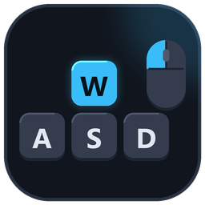
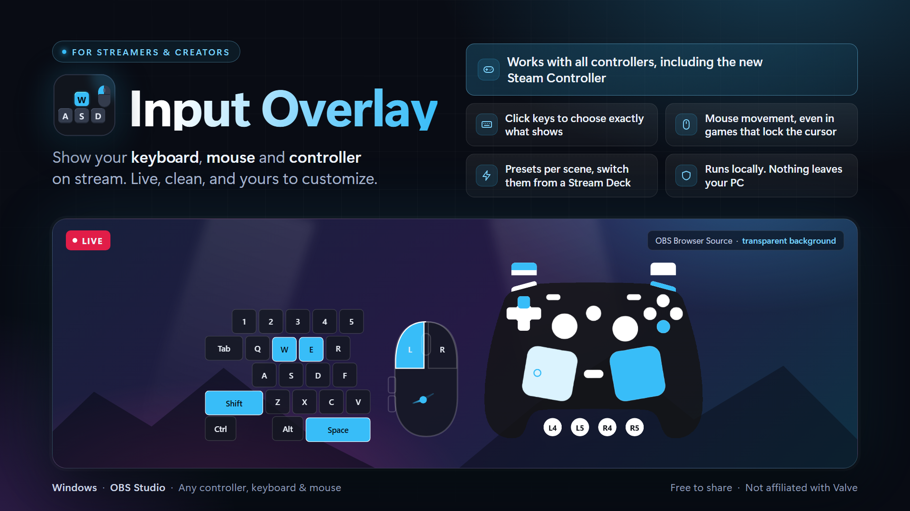

<p align="center"></p>

<h1 align="center">Input Overlay</h1>



A stream overlay that shows your **keyboard**, **mouse** and **game controller** live, for OBS or any other streaming software.
Highlight colours, themes and controller artwork are all adjustable, and you can switch between layouts with a Stream Deck.

- **Keyboard:** show the whole thing or only the keys you use (WASD, a custom set), with resizable keys.
- **Mouse:** buttons, scroll wheel, side buttons and a movement dot. It works in games that lock the cursor.
- **Controllers:** Steam Controller, Xbox, PlayStation 4 and 5, Switch Pro, Switch 2 Pro and GameCube, with analogue triggers, sticks and trackpads.
- **Gyro:** the controller picture can tilt, or an aim dot can follow your motion.
- **Presets:** build several layouts (say "Full", "WASD + Mouse", "Controller only") and switch between them live.
- **Themes:** Classic, Retro Pixel and Neon, or make your own.
- **Runs on your PC.** The download is Windows. The same server also runs on Linux under X11. Nothing is sent to the internet.

## Download and install

1. Download the zip file from the [Releases page](../../releases/latest), unzip it anywhere, and run `InputOverlay.exe`.
2. A tray icon appears, and the settings page opens the first time.

Windows or your antivirus may warn about the download. That is a false positive; see [Antivirus warnings](#antivirus-and-unrecognised-app-warnings) below.

### Linux

The packaged program is the Windows `.exe`. On Linux you run the server from a checkout. Python 3.12 and 3.13 both work.

```
git clone https://github.com/Ethral-T/input-overlay.git
cd input-overlay
```

Input capture is **X11 only**. A Wayland session, which is the default on Ubuntu and Fedora, does not give this program keystrokes or mouse input from native Wayland applications. Starting the server there still serves the overlay page, but keys pressed in a Wayland app never arrive. Use an X11 session (`DISPLAY` set, and not a Wayland compositor) for capture.

Install the system packages, then the Python packages from `requirements-linux.lock`:

```
sudo apt install python3-venv python3-pip libusb-1.0-0 xclip xdg-utils
python3 -m venv --system-site-packages .venv
.venv/bin/pip install --require-hashes --ignore-installed -r requirements-linux.lock
.venv/bin/python server.py
```

`--system-site-packages` is what lets the virtualenv import apt's PyGObject. Without `--ignore-installed`, pip treats libraries that are already installed for the system Python (such as idna, pillow, six and typing-extensions) as satisfied and skips their hash check. `--ignore-installed` puts a hash-checked copy of every locked package into the virtualenv.

`xsel` works in place of `xclip`. `xdg-utils` provides `xdg-open` for the themes folder. SDL3 is optional: install the package that provides `libSDL3.so.0` (Debian and Ubuntu: `libsdl3-0`) and controllers that SDL knows are used; without it that backend is skipped and `/dev/input/js*` is used instead.

The tray icon (`python app.py`) only has a menu when PyGObject and AppIndicator are installed:

```
sudo apt install python3-gi gir1.2-gtk-3.0 gir1.2-ayatanaappindicator3-0.1
```

`gir1.2-appindicator3-0.1` is the older package name, if the Ayatana one is not in your distro. On GNOME the icon stays hidden until the AppIndicator (KStatusNotifierItem) extension is enabled; Ubuntu ships it as `gnome-shell-extension-appindicator`. Those packages are installed for the system Python. A virtual environment created with plain `python3 -m venv .venv` cannot import them, so the menu stays missing even though apt installed them. `--system-site-packages` (in the command above) lets the environment see them, and the AppIndicator menu appears. Without these packages the server still runs, and the tray prints that Quit, Copy URL and Start at login are unavailable.

Copy URL uses `wl-copy` only when `WAYLAND_DISPLAY` is set. On X11 it uses `xclip` or `xsel`, including when `wl-copy` happens to be installed.

Settings are stored in `$XDG_CONFIG_HOME/InputOverlay` (or `~/.config/InputOverlay`). If `~/InputOverlay/config.json` or `~/InputOverlay/themes` is already there, that directory is kept so an older install is not orphaned. `INPUT_OVERLAY_HOME` overrides the location. Start at login writes `$XDG_CONFIG_HOME/autostart/input-overlay.desktop` (`~/.config/autostart` when that variable is unset). An entry with `Hidden=true` is treated as off.

`python server.py` and `python app.py` from a terminal print to that terminal. `log.txt` in the config directory is written only when there is no console (`stdout` or `stderr` is missing) or the app is the packaged program. A Linux terminal session does not create `log.txt`.

The server listens on `127.0.0.1` and does not run as root. Gamepads, the GameCube adapter and the Switch 2 Pro need the logged-in user to be allowed to open the device node. Do not make the nodes world-writable (`MODE="0666"`) and do not start the server with sudo. A udev rule with `TAG+="uaccess"` lets logind grant them to the active session. Create `/etc/udev/rules.d/70-input-overlay.rules`:

```
# Official GameCube adapter (USB 057e:0337)
SUBSYSTEM=="usb", ATTR{idVendor}=="057e", ATTR{idProduct}=="0337", TAG+="uaccess"
# Switch 2 Pro Controller (USB 057e:2069), including its hidraw node
SUBSYSTEM=="usb", ATTR{idVendor}=="057e", ATTR{idProduct}=="2069", TAG+="uaccess"
KERNEL=="hidraw*", ATTRS{idVendor}=="057e", ATTRS{idProduct}=="2069", TAG+="uaccess"
# Kernel joystick interface
SUBSYSTEM=="input", KERNEL=="js*", TAG+="uaccess"
```

Many desktops already tag `js*` this way. Replug the device after the rule is installed. `/dev/input/js*` still has to be readable by your user; if it is not, the Linux joystick backend says so and the controller picture stays disconnected.

## Set it up in OBS

1. In **Settings** (click the tray icon, or open `http://127.0.0.1:8765/settings`), pick a preset or make your own.
   - Click keys to hide or show them, or drag across several. The quick-select buttons (All, None, Letters, Digits, WASD and so on) do it in bulk.
   - Turn the mouse and controller on or off, then choose the highlight colour, size and theme.
2. In OBS, add a **Browser Source** with the URL `http://127.0.0.1:8765/`.
3. Type the width and height that Settings shows under **OBS Browser Source size** into the source's Width and Height boxes.

The source follows your **active preset**, so you never edit the URL again. Changes in Settings and preset switches show up
instantly, with no reload. To pin a source to one preset (for example a controller-only source on a second scene), use
`http://127.0.0.1:8765/?preset=<name>`.

The tray menu lets you open settings, change the active preset, copy the OBS URL (or one pinned to a preset), open the themes folder, start with Windows (or at login on Linux), and quit.
Presets are stored in `%APPDATA%\InputOverlay\config.json` on Windows. On Linux they are in `~/.config/InputOverlay` unless an older `~/InputOverlay` is already present; see [Linux](#linux). On Windows the log is `log.txt` next to the config. On Linux that file is written only when the process has no console, or when it is packaged; a terminal run prints to the terminal instead.

### Position and size

- **Position in source** (the 3x3 picker, set per preset; centre by default) pins the overlay to a corner, edge or the middle of the
  source, so switching presets doesn't make it jump.
- Use the **Size** slider to scale the overlay instead of stretching the source in OBS, which makes it blurry.
- To resize a key, drag the right edge of it in the Settings preview. It snaps to quarter-key steps, and the keys after it shift to
  follow. Double-click an edge to reset that key, or press **Reset key sizes** to clear them all.

## Switching presets with a Stream Deck

Anything that can send an HTTP GET works (Stream Deck, scripts, `curl`). In Stream Deck, use the built-in **Website** action with
"Access in background" ticked, or an API plugin such as BarRaider's API Ninja. Settings, in the Stream Deck card, has a **Show the URLs** button that lists
every URL with a Copy button.

| URL | What it does |
|---|---|
| `/api/switch/<name or number>` | Activate a preset by name (not case-sensitive) or by position, for example `/api/switch/2` |
| `/api/next`, `/api/prev` | Cycle through your presets |
| `/api/switch` | Report the active preset |
| `/api/gyro/tilt/toggle`, `/api/gyro/aim/toggle` | Turn the gyro tilt picture or aim dot on or off for every preset (use `on` or `off` instead of `toggle` to set it) |
| `/api/gyro/on`, `/api/gyro/off`, `/api/gyro/toggle` | Both gyro displays together |
| `/api/gyro` | Report the gyro state |

All URLs start with `http://127.0.0.1:8765`. Requests that a browser marks as cross-site are rejected, so a web page can't change your preset.

## Controllers

**Controller style** (Settings, Controller) picks the artwork: Steam Controller, Xbox, PlayStation 4, PlayStation 5, Nintendo Switch,
Switch 2 Pro or GameCube. **Auto-detect** (the default) picks one from the connected controller. Unknown or generic pads get the Xbox art.
Controllers are read through SDL3, with XInput as a fallback.

### Steam Controller
Trackpads have no click switch, so a "click" is pressure past a threshold. Adjust it with **Trackpad click pressure** in Settings, Controller.

### Gyro
For controllers that report motion (Steam Controller, PlayStation 4 and 5, Switch Pro), turn on **Gyro** in Settings, Controller:

- **Tilt the picture:** the controller leans the way you turn the real one, then settles back to level.
- **Aim dot:** a box beside the controller has a dot that follows your turn, leaves a fading trail and drifts back to the middle.

A gyroscope measures how fast the controller turns, not where it points, so both displays recentre by themselves. **Gyro sensitivity**
sets how far the picture leans and how fast the dot moves. The Switch 2 Pro, GameCube adapters and Xbox pads don't report gyro yet.

### GameCube controllers
Two kinds of adapter work, and both pick the GameCube artwork automatically:

- **Mayflash and similar adapters in PC mode** show up as an ordinary gamepad. Nothing to install.
- **The official Nintendo adapter (WUP-028), or a Mayflash in Wii U mode,** needs a **WinUSB driver**. Run [Zadig](https://zadig.akeo.ie/),
  choose "WUP-028" (Options, List All Devices), pick WinUSB and press Install. Close Dolphin while the overlay is running.
  Uninstall the driver in Device Manager if you want the adapter back as a normal device.

Only one program can use an adapter in Wii U mode at a time, so the overlay and a game can't both read it. Since a client update on
21 January 2026, Steam doesn't open Wii U-mode adapters unless you start it with `-enable-libusb-gamecube`, and then Steam and the
overlay will fight over the adapter. **To play and stream at the same time, put the adapter in PC mode.**

### Switch 2 Pro Controller
It is read over **USB** (not Bluetooth), so plug it in with a cable. Nothing needs installing. It gets its own artwork, including the
C button and the GL/GR back paddles. ZL and ZR show as on/off buttons.

**Steam takes exclusive hold of this controller.** If Steam is running the overlay can't read it, so quit Steam first (tray icon, Exit),
or give the controller a Gamepad layout in Steam so it shows up as a virtual Xbox pad (the overlay then uses the Xbox art unless you pick Nintendo Switch).

## Themes

Pick a theme in Settings, Appearance, **Theme**:

- **Classic:** the original look.
- **Retro Pixel:** 8-bit, with square bevelled keys, a pixel font, and a pixelated mouse and controller.
- **Neon:** glowing outlines in your highlight colour.

Some settings have an **all presets / this preset** tag you can click: **all presets** uses one value everywhere, **this preset**
lets each preset keep its own. This covers Theme, Highlight colour, Gyro, Fill opacity, Overall opacity and Mouse Button Invert.

**Make your own theme:** a theme is a folder of CSS, fonts and images. Copy `docs/theme-template/`, read [docs/THEMES.md](docs/THEMES.md), then drop the
folder into your themes folder (**Open themes folder** in Settings or the tray menu) and press **Refresh** next to the theme picker.
Themes can't run code and can't load anything from the internet, but only install themes from people you trust.

## URL options

Every setting can also be overridden in the Browser Source URL, for example `http://127.0.0.1:8765/?theme=pixel&controller=xbox`.

| Option | Values |
|---|---|
| `preset` | Preset name |
| `kb` | `full`, `compact`, `off` |
| `mouse` | `1`, `0` |
| `pad` | `auto` (only while connected), `1`/`on`, `0`/`off` |
| `accent` | Highlight colour, for example `f43f5e` or `orange` |
| `scale`, `opacity`, `fill` | Size, overall opacity (0.1-1) and fill opacity of the key, mouse and controller backgrounds (0-1) |
| `sens`, `tpt`, `tprot` | Mouse movement sensitivity, trackpad click pressure (0-1), trackpad tilt in degrees |
| `align` | `tl` `tc` `tr` `ml` `mc` `mr` `bl` `bc` `br` |
| `theme` | `default`, `pixel`, `neon`, or the folder name of your own |
| `controller` | `auto`, `steam`, `xbox`, `ps4`, `ps5`, `switch`, `switch2`, `gamecube` |
| `gyro`, `gsens` | `off`, `tilt`, `aim` or `both`, and its sensitivity |
| `static` | `1` doesn't connect to real input (for screenshots and demos) |
| `debug` | `1` shows the detected controller, button presses and gyro values in the corner |

## Troubleshooting

- **The overlay doesn't update in OBS after an upgrade:** right-click the source, Properties, **Refresh cache of current page**.
- **A mouse side button is the wrong one:** tick **Mouse Button Invert** in Settings.
- **Keys don't show in a game:** games running as administrator can block input hooks from a normal program. Run Input Overlay as administrator too.
- **The controller isn't detected:** add `?debug=1` to the URL to see what the program detects and which inputs it receives.
- **The numpad** isn't displayed yet.

## Security and privacy

The program listens on `127.0.0.1` only, so nothing outside your PC can connect, and it refuses requests from other websites, because
any web page could otherwise read your keystrokes from a local server. Don't start it with `--host 0.0.0.0` unless you mean to.

The keyboard hook is global: the overlay shows keys typed in any window, **including passwords**. Hide the source on sensitive screens.

## Antivirus and "unrecognised app" warnings

Windows SmartScreen, browsers and some antivirus scanners (including the combined results on VirusTotal) may flag the download or warn
that it is "unrecognised". This is a **false positive**, and it is common for tools like this. The reasons:

- **A global keyboard hook.** To show your keys in any window, the program uses a system-wide keyboard and mouse hook. That is how keyloggers
  work, so heuristic scanners treat it as suspicious. Input Overlay only sends what it sees to `127.0.0.1` (your own PC), and the source is open for you to check.
- **Not code-signed.** The program has no paid code-signing certificate, so SmartScreen shows "Windows protected your PC" until enough
  people have downloaded the file to build a reputation. Every new build starts from zero.
- **Built with PyInstaller.** The program is Python packed into an `.exe`, which is also how a lot of real malware is packaged. Scanners
  often flag the packer itself, so even a "hello world" PyInstaller app can trigger detections.
- **Direct USB access and bundled DLLs.** GameCube adapter and Switch 2 Pro support talk to the device through `libusb`, and gamepads go
  through `SDL3`. Low-level device access plus unsigned DLLs is another pattern scanners score as risky.
- **A local web server and a tray icon,** which malware also uses.
- **Few downloads.** Scanners lean on reputation, and a new small project has none yet.

**What you can do:** build it from source (below), read the code, or compare the zip's SHA-256 with the `.sha256.txt` file on the
Releases page. If your antivirus quarantines it, add an exclusion for the install folder, but only for a copy from this repository's
Releases page or one you built yourself.

## Build from source

You need Python 3.12. The packaged program is built on Windows.

```
build.bat            builds dist\InputOverlay\InputOverlay.exe (a folder: starts fast, fewer antivirus false positives)
build.bat onefile    builds a single dist\InputOverlay.exe (slower to start)
```

The build also needs two DLLs in `lib\`: `SDL3.dll` (the official SDL3 Windows x64 release from
[libsdl-org/SDL](https://github.com/libsdl-org/SDL)) and `libusb-1.0.dll` (libusb 1.0.30, `VS2022\MS64\dll` from the Windows .7z at
[libusb releases](https://github.com/libusb/libusb/releases)). Both are already included in the repository, and the build checks them against `lib/SHA256SUMS.txt`. Distribute the whole `dist\InputOverlay` folder.

Python packages are split so each platform installs only what it uses:

| File | What it is |
|---|---|
| `requirements.txt` | Shared: the web server, the tray icon, and Pillow |
| `requirements-windows.txt` | Shared, plus pynput |
| `requirements-linux.txt` | Shared, plus python-xlib |
| `requirements-dev.txt` | The Windows build: Windows requirements plus PyInstaller |

Hashes are in `requirements-windows.lock`, `requirements-linux.lock`, and `requirements-dev.lock`. Install with `--require-hashes`. Regenerate a lock with `pip-compile --allow-unsafe --generate-hashes --strip-extras` after changing its `.txt` file. Compile the Windows locks on Windows and the Linux lock on Linux, so each file only picks up that platform's packages. `requirements-constraints.txt` keeps the shared packages on the same versions in both locks.

To develop, run `python server.py` for the server in a console with no tray icon. Options: `--port 8765`, `--host 127.0.0.1`, and
`--pad N` (which controller to use when several are connected).

On Linux, install with `pip install --require-hashes -r requirements-linux.lock` and see [Linux](#linux) for the system packages, the X11 limit, and device access. Keyboard, mouse buttons, scroll and mouse movement are read with XInput2. Controllers come from `/dev/input/js*` when that device is readable, and the GameCube adapter and Switch 2 Pro use the system `libusb-1.0`. The tray app (`python app.py`) uses a desktop autostart entry instead of the Windows Run key.

**Controller artwork** is layered SVG: one named group per part, drawn dark and inverted by the overlay, so a new controller is a matter
of drawing the parts and naming the groups. The original files are in `assets/controllers/` and the copies the overlay uses are in
`overlay/img/`. Keep the group ids if you edit one, and see the `LAYERED` table in `overlay/index.html` for how parts map to inputs.

## Licence

Input Overlay is free software under the [MIT licence](LICENSE). It bundles other open-source components (SDL3, libusb and several
Python packages) that keep their own licences; see [THIRD_PARTY_NOTICES.md](THIRD_PARTY_NOTICES.md). Xbox, PlayStation, Nintendo, Steam and
the other product names belong to their owners; this project is independent and not affiliated with them.
